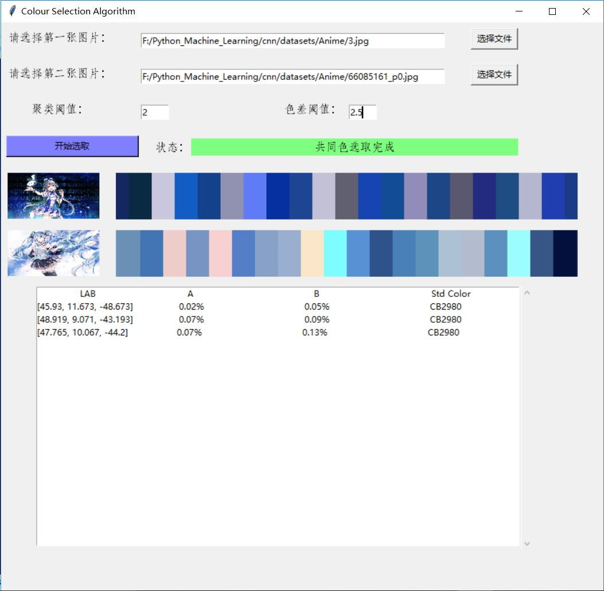
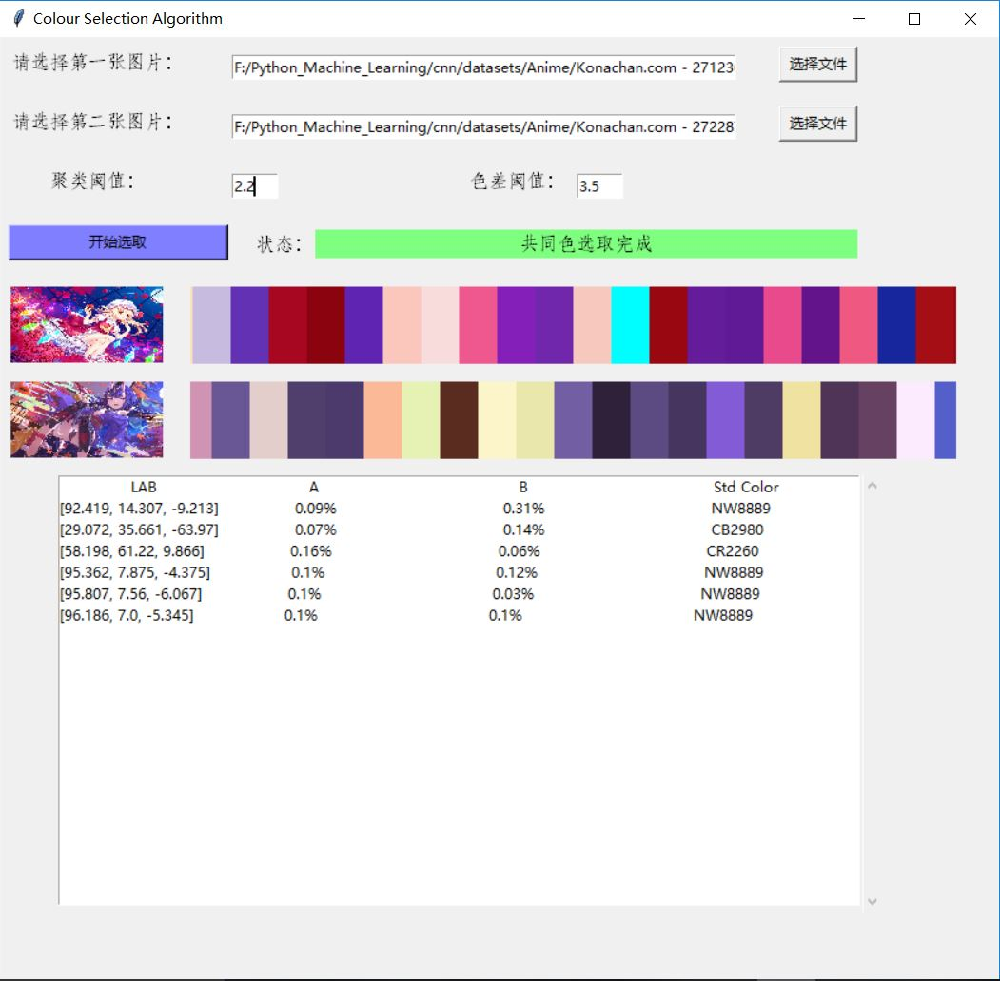
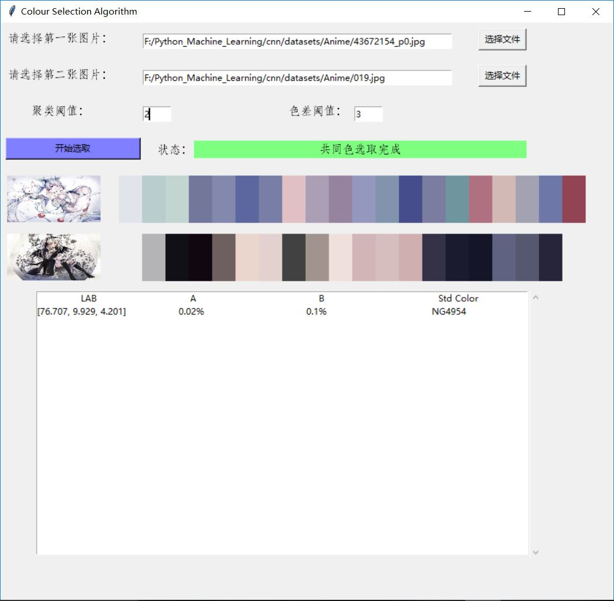
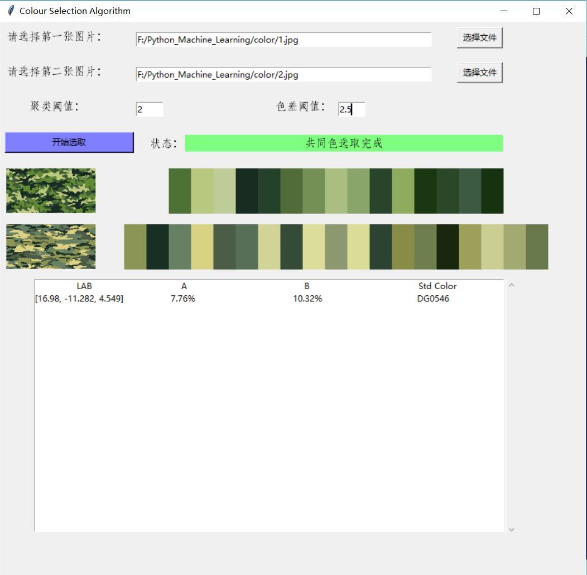

# Colour-Selection-Algorithm
同色选取算法（外面接的项目）——2018-11-27
### 更新至version11.py
### 库的选用：
- opencv
- numpy
- matplotlib
- tkinter
- sklearn
- operator
- PIL
### 思路
- 1 用基于密度的聚类算法DBSCAN将图片中的像素聚为色块
- 2 用K-均值聚类找到色块的聚类中心
- 3 用K-近邻算法找出最接近的标准色
# Demo:

